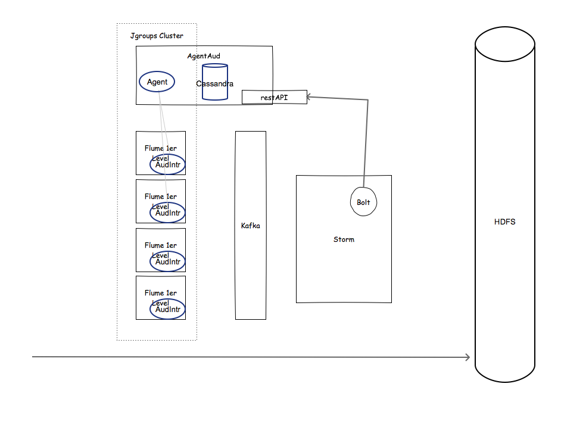

# Prueba de concepto para un sistema de auditoría de un broker de mensajería
Los menasajes capturados en inicio son firmados con la fecha de entrada y su representación md5, al objeto de comprobar que no son modificados de forma intencionada o no al final de la cadena.

En la siguiente imagen se muestra la arquitectura lógica. Con el borde azul las piezas objeto de desarrollo de este proyecto:

Se usa JGroups para crear una canal de comunicación entre el agente y los diferentes flumes.
El agente es responsable de almacenar los registros firmados en la base de datos CassandraDB. Además permitirá controlar la activación/desactivación de la auditoría a los diferentes agentes mediante paso de mensaje.
Los interceptores envían los mensajes firmados al agente para su registro en cassandra.